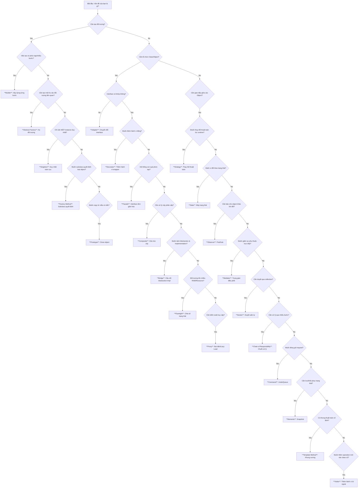

# Quy Trình Ra Quyết Định Chọn Design Pattern (Flowchart)

Sử dụng hướng dẫn này để xác định pattern phù hợp nhất cho vấn đề của bạn.

## Hướng dẫn nhanh
1. **Phân tích vấn đề cốt lõi:** Đừng chọn pattern vì "ngầu", hãy chọn vì nó giải quyết đúng nỗi đau (pain point).
2. **KISS (Keep It Simple, Stupid):** Nếu `if-else` giải quyết được vấn đề và dễ đọc, đừng dùng `Strategy`.
3. **YAGNI (You Aren't Gonna Need It):** Đừng áp dụng `Abstract Factory` nếu bạn chưa có ý định hỗ trợ hệ điều hành thứ 2.
