# Quy Trình Ra Quyết Định Chọn Design Pattern

Tài liệu này cung cấp sơ đồ cây quyết định (Decision Tree) giúp bạn chọn đúng Pattern cho vấn đề của mình.

## 1. Dạng Text-based (Dễ đọc nhất)

Hãy trả lời câu hỏi: **"Vấn đề chính của bạn nằm ở đâu?"**

### 🏗️ A. CREATIONAL (Khởi tạo đối tượng)
> *Vấn đề: "Tôi cần tạo đối tượng, nhưng việc dùng `new ClassName()` quá cứng nhắc hoặc phức tạp."*

- **Q: Bạn có cần đảm bảo chỉ có duy nhất MỘT instance toàn cục?**
  - ✅ YES -> **[Singleton](01.Creational/Singleton)** (e.g., Config, Connection Pool)
- **Q: Bạn có cần tạo đối tượng phức tạp qua từng bước?**
  - ✅ YES -> **[Builder](01.Creational/Builder)** (e.g., SQL Query Builder)
- **Q: Bạn muốn tạo một họ các đối tượng liên quan (Window, Button, Scrollbar)?**
  - ✅ YES -> **[Abstract Factory](01.Creational/AbstractFactory)** (e.g., UI Theme)
- **Q: Bạn muốn subclass quyết định loại đối tượng nào được tạo?**
  - ✅ YES -> **[Factory Method](01.Creational/FactoryMethod)** (e.g., Logistics -> Truck/Ship)
- **Q: Bạn muốn tạo bản sao từ một mẫu có sẵn thay vì tạo mới?**
  - ✅ YES -> **[Prototype](01.Creational/Prototype)** (e.g., Clone Settings)

---

### 🧩 B. STRUCTURAL (Cấu trúc hệ thống)
> *Vấn đề: "Tôi cần kết hợp các class lại với nhau, nhưng interface không khớp hoặc cấu trúc quá rối."*

- **Q: Interface không tương thích?**
  - ✅ YES -> **[Adapter](02.Structural/Adapter)** (e.g., 3rd Party Payment)
- **Q: Muốn thêm hành vi động vào đối tượng mà không sửa class gốc?**
  - ✅ YES -> **[Decorator](02.Structural/Decorator)** (e.g., Middleware, Logging Wrapper)
- **Q: Hệ thống con quá phức tạp, cần một interface đơn giản?**
  - ✅ YES -> **[Facade](02.Structural/Facade)** (e.g., Order System Wrapper)
- **Q: Cần xử lý cấu trúc cây (Folder/File)?**
  - ✅ YES -> **[Composite](02.Structural/Composite)** (e.g., Menu đa cấp)
- **Q: Đối tượng tốn quá nhiều RAM, cần chia sẻ trạng thái?**
  - ✅ YES -> **[Flyweight](02.Structural/Flyweight)** (e.g., Game Sprites)
- **Q: Cần kiểm soát truy cập vào đối tượng (Lazy load, Security)?**
  - ✅ YES -> **[Proxy](02.Structural/Proxy)** (e.g., Virtual Proxy)
- **Q: Muốn tách rời Abstraction khỏi Implementation để phát triển độc lập?**
  - ✅ YES -> **[Bridge](02.Structural/Bridge)** (e.g., Remote Control & Device)

---

### 📡 C. BEHAVIORAL (Hành vi & Giao tiếp)
> *Vấn đề: "Tôi cần quản lý cách các đối tượng giao tiếp và phân công trách nhiệm."*

- **Q: Muốn thay đổi thuật toán lúc chạy (Runtime)?**
  - ✅ YES -> **[Strategy](03.Behavioral/Strategy)** (e.g., Discount Calculation)
- **Q: Cần thông báo cho nhiều đối tượng khi một đối tượng thay đổi?**
  - ✅ YES -> **[Observer](03.Behavioral/Observer)** (e.g., Event Listener)
- **Q: Muốn duyệt qua danh sách mà không quan tâm cấu trúc lưu trữ?**
  - ✅ YES -> **[Iterator](03.Behavioral/Iterator)** (e.g., Foreach Loop)
- **Q: Hành vi thay đổi theo trạng thái nội tại?**
  - ✅ YES -> **[State](03.Behavioral/State)** (e.g., Order Status Flow)
- **Q: Muốn đóng gói request để Undo/Redo hoặc Queue?**
  - ✅ YES -> **[Command](03.Behavioral/Command)** (e.g., Text Editor Undo)
- **Q: Xử lý request qua chuỗi các bước (Middleware)?**
  - ✅ YES -> **[Chain of Responsibility](03.Behavioral/ChainOfResp)** (e.g., Auth Pipeline)
- **Q: Giảm sự phụ thuộc chéo giữa các object (Chat Room)?**
  - ✅ YES -> **[Mediator](03.Behavioral/Mediator)** (e.g., Chat Hub)
- **Q: Định nghĩa khung thuật toán, để con cái thực hiện chi tiết?**
  - ✅ YES -> **[Template Method](03.Behavioral/TemplateMethod)** (e.g., Data Import)

---

## 2. Dạng Sơ đồ (Visual Chart)

Dưới đây là sơ đồ tổng quan sử dụng Mermaid. Nếu bạn dùng VS Code, hãy cài extension **Markdown Preview Mermaid Support** để xem.

```mermaid
graph TD
    Root[Vấn đề của bạn là gì?]
    Root -->|Tạo Object| Creation(CREATIONAL)
    Root -->|Tổ chức Class| Structure(STRUCTURAL)
    Root -->|Giao tiếp| Behavior(BEHAVIORAL)

    %% CREATIONAL
    Creation -->|Duy nhất| Singleton
    Creation -->|Phức tạp từng bước| Builder
    Creation -->|Họ đối tượng| AbstractFactory
    Creation -->|Subclass quyết định| FactoryMethod
    Creation -->|Copy mẫu| Prototype

    %% STRUCTURAL
    Structure -->|Khác Interface| Adapter
    Structure -->|Thêm hành vi động| Decorator
    Structure -->|Interface đơn giản| Facade
    Structure -->|Cấu trúc cây| Composite
    Structure -->|Tối ưu RAM| Flyweight
    Structure -->|Kiểm soát truy cập| Proxy
    Structure -->|Tách Abstraction| Bridge

    %% BEHAVIORAL
    Behavior -->|Thay thuật toán| Strategy
    Behavior -->|Pub/Sub| Observer
    Behavior -->|Duyệt List| Iterator
    Behavior -->|Máy trạng thái| State
    Behavior -->|Undo/Queue| Command
    Behavior -->|Chuỗi xử lý| ChainOfResp
    Behavior -->|Trung gian| Mediator
    Behavior -->|Khung thuật toán| TemplateMethod
```

## Hướng dẫn nhanh
1. **Phân tích vấn đề cốt lõi:** Đừng chọn pattern vì "ngầu", hãy chọn vì nó giải quyết đúng nỗi đau (pain point).
2. **KISS (Keep It Simple, Stupid):** Nếu `if-else` giải quyết được vấn đề và dễ đọc, đừng dùng `Strategy`.
3. **YAGNI (You Aren't Gonna Need It):** Đừng áp dụng `Abstract Factory` nếu bạn chưa có ý định hỗ trợ hệ điều hành thứ 2.
